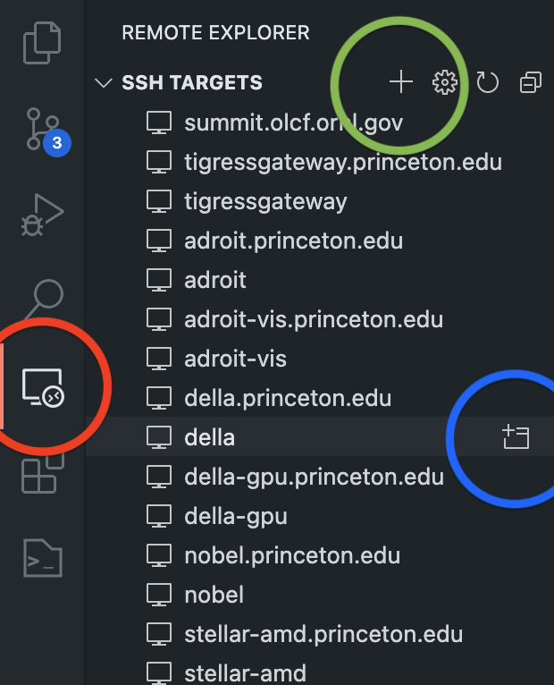

# Remote Code Editing

Although [Visual Studio Code (vscode)](https://code.visualstudio.com) was
originally developed by Microsoft it is near platform independent. Meaning, on
whatever devices you work on, you will be able to launch vscode. It now has been
adopted by many users, who have developed a plethora of extensions that make
your coding life a breeze.

In this article, we will focus on a couple of extensions that enable coding on
the the HPC cluster from the comfort of your comfortzone.

1. [Remote Development Extension](#remote-development-extension) -> [External Docs](https://code.visualstudio.com/docs/remote/remote-overview)
2. [Jupyter Notebooks](#jupyter-notebooks) -> [External Docs](https://code.visualstudio.com/docs/datascience/jupyter-notebooks)

***DISCLAIMER***: At this moment this does not work for Traverse because 
`vscode-server` does not natively support IBM Power9 architecture.

## Remote Development Extension

The Remote Development Extension (RDE) allows the user to access the filesystem
visually from their local machine through SSH. A non-gui vscode-server is
launched on the remote machine that "sends" information from the remote machine
to your local machine. This is show in the Figure below.

<p align="center">

</p>

_Figure taken from (https://code.visualstudio.com/docs/remote/remote-overview)_

For the user, this simply means after providing vscode with
the needed credentials either "by hand" or with the `.ssh/config`, vscode will
automatically open a new window, to the remote machine and the base directory is
the default directory of the ssh command. Let's go through this step by step.

1. Install vscode (if you haven't yet) -- [vscode](https://code.visualstudio.com)
2. Install the Remote Development Extension Pack -- [RDE Pack](https://marketplace.visualstudio.com/items?itemName=ms-vscode-remote.vscode-remote-extensionpack). The RDE should show add a new menu button on the left hand-side indicated by the red circle in the image below.
   <p align="center">
   
   </p>

    _Screenshot from local machine. The red circle indicates the button that
    brings you to the 'Remote Explorer'. The green circle enables you to add a
    new host manually. The blue circle indicates the button that will open a
    remote folder that is defined in your `~/.ssh/config`_

3. Now, you should be able to connect to the remote machine using two ways.
   Either you connect manually by clicking on the `+` indicated by the green
   circle in the above figure and enter your ssh command as you usually connect,
   or you use the configuration of an existing `~/.ssh/config`. In fact, the former option will add an entry to your `~/.ssh/config`. In the next section,
   we discuss how to add an entry to the `~/.ssh/config`.

4. `vscode` should open a new window which tries to connect to the remote
   machine. If successful, you should be able to open a specific folder
   containing your code just as you would on your local machine with th
   difference that you are exploring the file system of the remote machine. 

***DISCLAIMER 1***: Only connect to specific folder on the clusters, do _not_
connect to, e.g. `/scratch/gpfs/<puid>` or `/home/<puid>`. These folder contain
all users and all their files. Vscode frequently updates the file explorer. This
update takes longer the larger the amount of subdirectories vscode has to scan.
In the case of `/home/` or `/scratch/gpfs/`, the amount of subdirectories is
immense.

***DISCLAIMER 2***: There are a thousand reasons why your session may not start
succesfully. A first step in the debugging process should always be: 'Can I
connect to the remote machine via `ssh` from the terminal to begin with?' If
not, there's just no way that vscode could connect either. If that's possible
the next step would be to try killing a possibly running `vscode-server` by
opening the command palette and killing the remote session. On a Mac,
`Cmd+Shift+P` to open the command palette, on Windows/Linux `Ctrl+Shift+P`, then
`Remote SSH: Kill VS Code Server on Remote Host ...` , which will prompt a selection
of possible hosts. Choose the host you want to connect to, e.g.,
`<puid>@tigergpu.princeton.edu`.


### Editing your `~/.ssh/config`

An example entry for connecting to `della` in the `~/.ssh/config` could be:

```ssh-config
Host della.princeton.edu della
  User <netid>
  HostName della.princeton.edu
  ControlMaster auto
  ControlPersist yes
  ControlPath ~/.ssh/sockets/%p-%h-%r
```
where the `Control*` parameters enable us to stay connected to the cluster. 

Adding a layer of complexity one could add a `ProxyJump` through `tigressgateway`, which ultimately removes the DUO requirement at every connection.

```ssh-config
Host tigressgateway.princeton.edu tigressgateway
  HostName tigressgateway.princeton.edu
  User <netid>
  ControlMaster auto
  ControlPersist yes
  ControlPath ~/.ssh/sockets/%p-%h-%r
  ServerAliveInterval 300
  LocalForward 5901 adroit-vis.princeton.edu:5901
  LocalForward 5902 tigressdata.princeton.edu:5902

Host della.princeton.edu della
  User <netid>
  HostName della.princeton.edu
  ProxyJump tigressgateway.princeton.edu
  ControlMaster auto
  ControlPersist yes
  ControlPath ~/.ssh/sockets/%p-%h-%r
```

For details on suppressing DUO with a ProxyJump, please visit [Removing Tedium](https://github.com/PrincetonUniversity/removing_tedium/tree/master/01_suppressing_duo#ii-multiplexing-approach-vpn-free).

## Jupyter Notebooks on the Cluste

Using the Python extension, Jupyter notebooks are natively supported in VSCode.
However, to run the on the cluster, we have to complete some extra steps:

This workflow lets you run Jupyter notebooks on on `tigergpu` in
`vscode` running on your laptop:

1. Install the `Remote Development Extension` as described above. 
2. Connected to, e.g., `tigergpu` (head node). To simplify the setup it is also
   helpful to load the `anaconda` module in my `~/.bashrc file` on the cluster:
   ```bash
   module load anaconda/4.4.0
   ```
   This was needed because I don't know how to load the environment module
   in vscode and it needs an environment that contains Jupyter.

3. I ran a simple notebook:
   ```python
   print('hello world!'))
   ```
   on tigergpu's head node to make sure everything works properly. It's important to note here that the Python extension has to be installed on the remote server as well! So, go to the extensions tab and double check. Otherwise, you will _not_ be able to select a environment specific interpreter.

4. On tigergpu, I requested an salloc session:
   ```bash
   salloc -N 1 -n 4 -t 0:20:0
   ```
   Note the hostname of the node, e.g., `tiger-i26c2n17`. Note that for the 
   purpose of the example, we did not ask for a GPU for the purpose of the 
   example because it takes longer to get an allocation for GPU nodes. It is 
   however no problem at all.

5. On your laptop, add this entry to my `~/.ssh/config`:
   ```ssh-config
   Host tiger-compute
       User <puid>
       Hostname tiger-i26c2n17
       ProxyJump tigergpu
   ```
   The `User` keyword is only important when your local username is different
   from your puid.

   One downside of that method is that you will need to modify your config
   file every time you get an salloc session. There might be ways around
   that. The good thing is that vscode seems to parse your config file when
   it gives suggestions for hosts to connect to.

6. On your local machine, you can open a remote vscode session on
   `tiger-compute` (vscode recognized that host from my config file).

7. Then, you should be able to run the notebook on the compute node.


