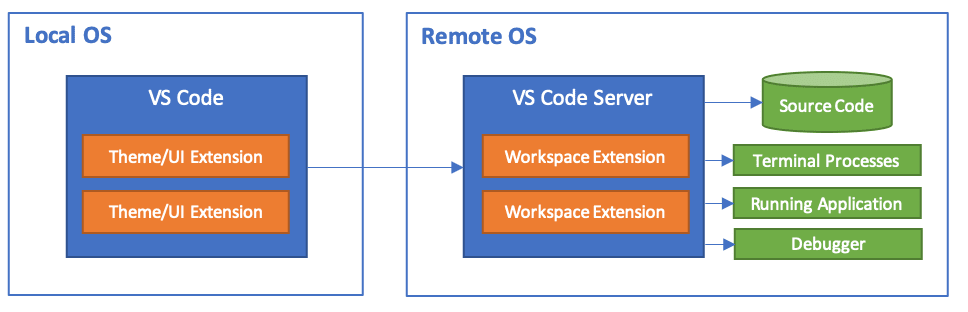

# Remote Code Editing

Although [Visual Studio Code (vscode)](https://code.visualstudio.com) was
originally developed by Microsoft it is near platform independent. Meaning, on
whatever devices you work on, you will be able to launch vscode. It now has been
adopted by many users, who have developed a plethora of extensions that make
your coding life a breeze.

In this article, we will focus on a couple of extensions that enable coding on
the the HPC cluster from the comfort of your comfortzone.

1. [Remote Development Extension](#remote-development-extension) -> [External Docs](https://code.visualstudio.com/docs/remote/remote-overview)
2. [Jupyter Notebooks](#jupyter-notebooks) -> [External Docs](https://code.visualstudio.com/docs/datascience/jupyter-notebooks)

***DISCLAIMER***: At this moment this does not work for Traverse because 
`vscode-server` does not natively support IBM Power9 architecture.

## Remote Development Extension

The Remote Development Extension (RDE) allows the user to access the filesystem
visually from their local machine through SSH. A non-gui vscode-server is
launched on the remote machine that "sends" information from the remote machine
to your local machine. This is show in the Figure below.

<p align="center">

</p>

_Figure taken from (https://code.visualstudio.com/docs/remote/remote-overview)_

For the user, this simply means after providing vscode with
the needed credentials either "by hand" or with the `.ssh/config`, vscode will
automatically open a new window, to the remote machine and the base directory is
the default directory of the ssh command. Let's go through this step by step.

1. Install vscode (if you haven't yet) -- [vscode](https://code.visualstudio.com)
2. Install the Remote Development Extension Pack -- [RDE Pack](https://marketplace.visualstudio.com/items?itemName=ms-vscode-remote.vscode-remote-extensionpack). The RDE should show add a new menu button on the left hand-side indicated by the red circle in the image below.
    <p align="center">
    
    </p>

    _Screenshot from local machine. The red circle indicates the button that
    brings you to the 'Remote Explorer'. The green circle enables you to add a
    new host manually. The blue circle indicates the button that will open a
    remote folder that is defined in your `~/.ssh/config`_

3. Now, you should be able to connect to the remote machine using two ways.
   Either you connect manually by clicking on the `+` indicated by the green
   circle in the above figure and enter your ssh command as you usually connect,
   or you use the configuration of an existing `~/.ssh/config`. In fact, the former option will add an entry to your `~/.ssh/config`. 

4. vscode should open a new window which tries to connect to the remote machine.
   If successful, you should be able to open a specific folder containing your
   code just as you would on your local machine with th difference that you are
   exploring the file system of the remote machine. 

***DISCLAIMER 1***: Only
connect to specific folder on the clusters, do not connect to, e.g.
`/scratch/gpfs/`. This folder contains all users and all their files. Vscode
frequently updates the file explorer. This update takes longer the larger the
amount of subdirectories vscode has to scan. In the case of `/home/` or
`/scratch/gpfs/`, the amount of subdirectories is immense

***DISCLAIMER 2***: There are a thousand reasons why your session may not start succesfully. A first step in the debugging process should always be: 'Can I connect to the remote machine via `ssh` from the terminal to begin with?' If not, there's just no way that vscode could connect either.

### Editing your `~/.ssh/config`

An example entry for connecting to `della` in the `~/.ssh/config` could be:

```ssh-config
Host della.princeton.edu della
  User <netid>
  HostName della.princeton.edu
  ControlMaster auto
  ControlPersist yes
  ControlPath ~/.ssh/sockets/%p-%h-%r
```
where the `Control*` parameters enable us to stay connected to the cluster. 

Adding a layer of complexity one could add a `ProxyJump` through `tigressgateway`, which ultimately removes the DUO requirement at every connection.

```ssh-config
Host tigressgateway.princeton.edu tigressgateway
  HostName tigressgateway.princeton.edu
  User <netid>
  ControlMaster auto
  ControlPersist yes
  ControlPath ~/.ssh/sockets/%p-%h-%r
  ServerAliveInterval 300
  LocalForward 5901 adroit-vis.princeton.edu:5901
  LocalForward 5902 tigressdata.princeton.edu:5902

Host della.princeton.edu della
  User <netid>
  HostName della.princeton.edu
  ProxyJump tigressgateway.princeton.edu
  ControlMaster auto
  ControlPersist yes
  ControlPath ~/.ssh/sockets/%p-%h-%r
```

For details on suppressing DUO with a ProxyJump, please visit [Removing Tedium](https://github.com/PrincetonUniversity/removing_tedium/tree/master/01_suppressing_duo#ii-multiplexing-approach-vpn-free).

## Jupyter Notebooks

Coming soon...

